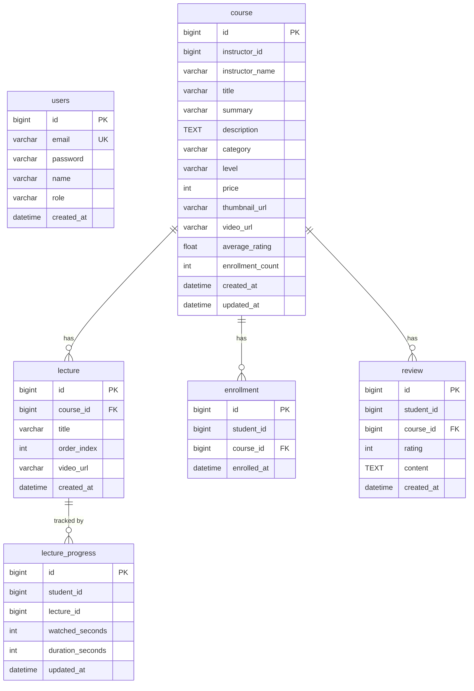

# DevClass — 프로젝트 전체 개요

## 프로젝트 소개
온라인 IT 강의 플랫폼. 강사가 강의와 동영상을 등록하고, 수강생이 수강 신청·동영상 시청·리뷰를 남기는 서비스.

---

## 기술 스택

| 영역 | 기술 |
|---|---|
| 백엔드 | Spring Boot 4.0.3, Java 21, Spring Data JPA (Hibernate 7), Spring Security Crypto |
| DB | MySQL 8.0 (Aiven Cloud), Hikari Connection Pool |
| 프론트엔드 | React 19, Vite 8, Tailwind CSS 4, axios, React Router v7 |
| API 문서 | springdoc-openapi 3.0.2 (Swagger UI) |

---

## 폴더 구조

```
P2/
├── backend/                          # Spring Boot 프로젝트
│   ├── build.gradle
│   ├── settings.gradle
│   ├── gradlew / gradlew.bat
│   ├── src/main/resources/
│   │   └── application.yaml
│   └── src/main/java/com/devclass/backend/
│       ├── BackendApplication.java
│       ├── common/                   # ApiResponse, BusinessException, ErrorCode, GlobalExceptionHandler
│       ├── controller/               # AuthController, CourseController, EnrollmentController,
│       │                             #   LectureProgressController, ReviewController, VideoController
│       ├── domain/                   # Course, Enrollment, Lecture, LectureProgress, Review, User
│       ├── dto/                      # 요청/응답 DTO 전체
│       ├── repository/               # JPA Repository 인터페이스
│       └── service/                  # 비즈니스 로직
│
└── frontend/                         # React + Vite 프로젝트
    ├── package.json
    ├── vite.config.js
    ├── index.html
    └── src/
        ├── main.jsx
        ├── App.jsx                   # 라우팅
        ├── index.css
        ├── api/                      # axios 클라이언트 + API 함수
        ├── context/AuthContext.jsx   # 로그인 상태 전역 관리
        ├── components/               # Layout, CourseCard
        ├── data/mockData.js          # 카테고리 상수
        └── pages/                    # 8개 페이지
```

---

## 주요 기능 목록

1. **회원가입 / 로그인** — 역할(student / instructor) 선택, BCrypt 암호화
2. **강의 목록** — 카테고리·난이도·정렬(최신/인기/평점) 필터, 페이지네이션
3. **강의 상세** — 커리큘럼, 강사 소개, 리뷰 목록, 수강 신청 버튼
4. **강의 등록** (강사 전용) — 멀티파트: JSON + 동영상 파일 업로드
5. **동영상 시청** — HTTP 206 Range 스트리밍, 실시간 진도율 추적
6. **진도율 추적** — 30초마다 자동 저장, pause/ended/beforeunload 시 저장
7. **리뷰** — 70% 이상 시청 후 작성 가능, 수정/삭제
8. **내 수강 목록** (학생) — 수강 중인 강의 카드, 수강 취소
9. **수강생 현황** (강사 전용) — 수강생별 진도율 바, 리뷰 가능 여부 배지

---

## 실행 방법

### 백엔드
```bash
cd P2/backend
./gradlew bootRun          # Mac/Linux
gradlew.bat bootRun        # Windows
# → http://localhost:8081
# → Swagger UI: http://localhost:8081/swagger-ui.html
```

### 프론트엔드
```bash
cd P2/frontend
npm install
npm run dev
# → http://localhost:5173
```

> Vite는 `/api` 경로를 `http://localhost:8081`로 프록시합니다 (`vite.config.js`).

---

## DB 설정 (application.yaml)

```yaml
spring:
  datasource:
    url: jdbc:mysql://<HOST>:<PORT>/<DB>?createDatabaseIfNotExist=true&useSSL=true&requireSSL=true&serverTimezone=Asia/Seoul&characterEncoding=UTF-8
    username: <USER>
    password: <PASSWORD>
  jpa:
    hibernate:
      ddl-auto: update      # 테이블 자동 생성/업데이트
    show-sql: true
    open-in-view: false
  servlet:
    multipart:
      max-file-size: 500MB
      max-request-size: 500MB
app:
  upload:
    dir: uploads/videos     # 동영상 저장 경로 (백엔드 루트 기준)
server:
  port: 8081
```

`ddl-auto: update` — 백엔드 시작 시 테이블이 없으면 자동 생성, 있으면 컬럼 변경만 반영 (데이터 보존).

---

## ERD (Mermaid)



---

## API 엔드포인트 요약

| Method | Path | 설명 |
|---|---|---|
| POST | /api/auth/signup | 회원가입 |
| POST | /api/auth/login | 로그인 |
| GET | /api/courses | 강의 목록 (필터·정렬·페이지) |
| POST | /api/courses | 강의 등록 (multipart) |
| GET | /api/courses/{id} | 강의 단건 조회 |
| PUT | /api/courses/{id} | 강의 수정 |
| DELETE | /api/courses/{id} | 강의 삭제 |
| GET | /api/courses/{id}/students | 수강생 현황 (강사 전용) |
| GET | /api/courses/{id}/reviews | 리뷰 목록 |
| POST | /api/courses/{id}/reviews | 리뷰 작성 |
| PUT | /api/courses/{id}/reviews/{reviewId} | 리뷰 수정 |
| DELETE | /api/courses/{id}/reviews/{reviewId} | 리뷰 삭제 |
| POST | /api/enrollments | 수강 신청 |
| DELETE | /api/enrollments/{id} | 수강 취소 |
| GET | /api/enrollments/student/{studentId} | 수강생 수강 목록 |
| PUT | /api/progress/lectures/{lectureId} | 진도율 업데이트 |
| GET | /api/progress/courses/{courseId} | 강의 전체 진도율 |
| GET | /api/videos/{filename} | 동영상 스트리밍 (Range 지원) |

---

## 프론트엔드 라우팅

| Path | 컴포넌트 | 접근 |
|---|---|---|
| /login | LoginPage | 누구나 |
| /signup | SignupPage | 누구나 |
| / | MainPage | 로그인 필요 |
| /courses | CourseListPage | 로그인 필요 |
| /courses/new | CourseFormPage | 강사만 |
| /courses/:id | CourseDetailPage | 로그인 필요 |
| /courses/:id/edit | CourseFormPage | 강사만 |
| /courses/:id/watch | CourseWatchPage | 로그인 필요 |
| /courses/:id/students | CourseStudentsPage | 강사만 |
| /my-courses | MyCoursesPage | 로그인 필요 |
